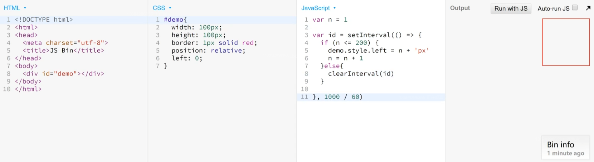
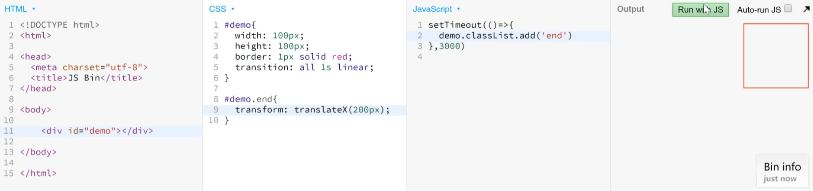
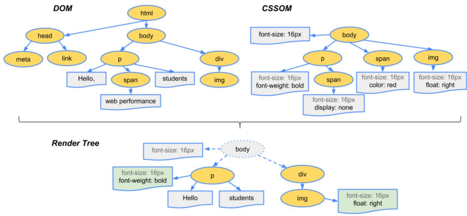
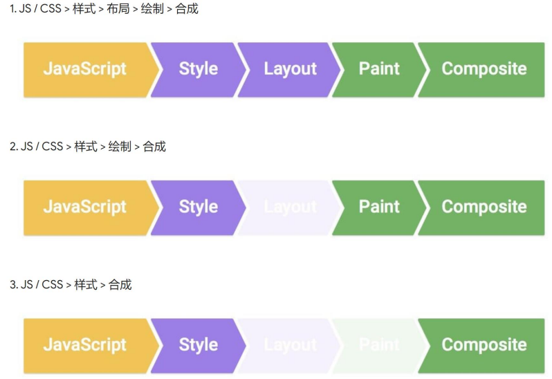
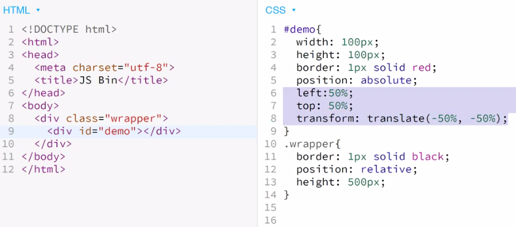
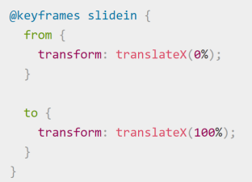
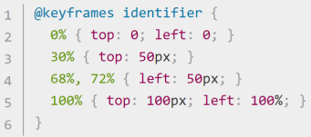

<!-- 2022.02.25: 2h -->
# CSS 动画
CSS动画就是由很多静止的画面（帧）以一定的速度（如24帧每秒）连续播放，肉眼因为视觉残像而产生错觉，误以为是和显示生活中一样的活动画面。



小技巧：setInterval 计时器函数一般会无限重复执行，只能通过刷新页面来终止它的活动，而 clearInterval(id) 可以避免刷新页面来终止计时器。



后者代码中使用类（‘end’）来修改样式，和前者代码比较则有一个经验之谈：<strong>JS中加样式不如加类，因为一个类中可以有很多样式。</strong>

查看渲染过程：开发者工具→按ESC→rendering→✔ paint flashing

视口中，出现绿色则表示重新绘制（repaint）。<strong>满视口查看，</strong>可以观察到，第一种方式在执行动画过程中，每一步都会渲染一次，但第二种方式只渲染两次：一次是动画执行前，一次是动画执行完了。

推荐用第二种方式做动画，即用transform（变形）。transform: translateX(0=>300px)，直接修改会被合成，需要等一会儿修改。transform并没有像第一种方式使用left那样重新绘制，因此性能好。

## 渲染
### 参考文献
* <a href="https://developers.google.com/web/fundamentals/performance/critical-rendering-path/render-tree-construction">渲染树构建、布局及绘制</a>
* <a href="https://developers.google.com/web/fundamentals/performance/rendering/">渲染性能</a>
* <a href="https://developers.google.com/web/fundamentals/performance/rendering/stick-to-compositor-only-properties-and-manage-layer-count">使用transform来实现动画</a>
* <a href="https://csstriggers.com/">CSSTriggers.com</a>，查看哪个属性触发哪些渲染过程

### 渲染过程
* 步骤
  1. 根据HTML构建HTML树（DOM）
  2. 根据CSS构建CSS树（CSSOM）
  3. 将两棵树合并成一颗渲染树（render tree）
  4. 布局：文档流、盒模型、计算大小和位置。
  5. 绘制：把边框颜色、文字颜色、阴影等画出来。
  6. 合成：根据层叠关系展示画面。



### 三种更新方式



不同属性触发流程不一样，要么一个一个试，看看它们触发哪些流程，要么查阅别人测试的结果：<a href="https://csstriggers.com/">CSSTriggers.com</a>。

### CSS 动画优化
面试题，死记硬背，频率大概是20次会有一次。要求不是很高，要保证能答到第1点，更全面一点就加上2、3点，精通就看第4点：
1. 使用transform
2. JS优化：使用requestAnimationFrame代替setTimeout或者setInterval
3. CSS优化：使用will-change或translate

### transform（变形）
以下关于transform的常用介绍没多大必要去看，推荐直接去搜索 transform mdn 然后看文档，更细。提一点经验：
  1. transform一般都需要配合 transition 过渡，这样变化就不会显得突兀。
  2. inline元素不支持transform，需要转为block。

* translate（位移）
  1. 常用写法

``` css 
    div {
        transform: translateX(<length | percentage>);
        /* length 长度，percentage 百分比（相对自身） */
        transform: translateY(<length | percentage>);
        transform: translate(<length | percentage>, <length | percentage>?);
        /* ? 表示可以省略 */
        transform: translateZ(<length | percentage>);
        /* 要结合视点 perspective */
        transform: translate3d(x, y, z);
    }
```

经验：<strong>绝对居中的经典代码</strong>



* scale（缩放）

``` css 
    div {
        transform: scaleX(<number>);
        /* number 数字 */
        transform: scaleY(<number>);
        transform: scale(<number>, <number>?);
    }
```

经验：用得较少，因为容易出现模糊。

* rotate（旋转）

``` css 
    div {
        transform: rotateX(<angle | zero>);
        /* angle 单位：deg */
        transform: rotateY(<angle | zero>);
        transform: rotateZ(<angle | zero>);
        transform: rotate(<angle | zero>);
    }
```

经验：一般用于360度旋转制作loading。

### transition（过渡）
补充中间帧。

* 语法
  1. transition: 属性名 时长 过渡方式 延迟; 比如: transition: left 200ms linear;
  2. 可以用逗号分隔两个不同属性。比如 transition: left 200ms, top 400ms;
  3. 可以用 all 代表所有属性。比如 transition: all 200ms;
  4. 过渡方式常见：linear | ease | ease-in | ease-in-out | ease-out ，<a herf="https://developer.mozilla.org/zh-CN/docs/Web/CSS/timing-function">详情参考</a>。

* 可以/不可以 过渡的属性
  1. display: block => display: none 无法过渡。显示和隐藏可以用 visibility: visible => visibility: hidden 或者 opacity: 1 => opacity: 0。但是后两种方法，元素隐藏后实际上还会占用那里的位置，而display则会完全删除属性，原来的位置会空出来。
  2. background可以过渡。

### animation（动画）
* <a href="https://developer.mozilla.org/en-US/docs/Web/CSS/@keyframes">两种标准写法 mdn</a>





animation: 时长 | 过渡方式 | 延迟 | 次数 | 方向 | 填充模式 | 是否暂停 | 动画名;
  1. 过渡方式，和transition取值一样。
  2. 次数，数字 或者 infinite。
  3. 方向，alternate 比较常用。
  4. 填充模式，forwards 可以使动画停留在最后的状态。
  5. 是否暂停，paused | running。
  6. 以上所有赋值都有对应的独立属性名。